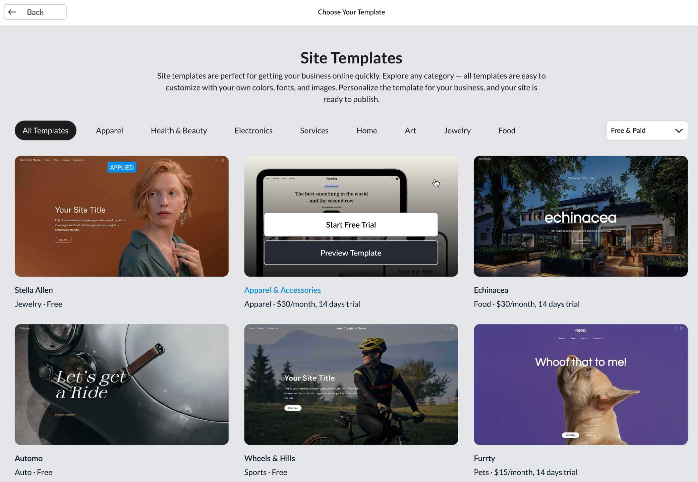

# Introduction to Site templates development

With Ecwid, you can build a website tailored to your business needs, whether or not they require an online store. The website builder called **Instant Site** offers many tools for creating a truly unique multipage and multilingual site. Read more about its built-in features in the [Help Center](https://support.ecwid.com/hc/en-us/articles/207100069-What-is-Instant-Site).

If you want to customize your website even more, you can use dev tools to build **Site templates** or **Custom sections:**

* **Site templates** allow you to completely overhaul your website's look and feel. Or even offer website designs to all Instant Site users through the template market. Get started easily with the [quickstart-guide-to-a-working-site-template.md](develop-site-templates/quickstart-guide-to-a-working-site-template.md "mention")
* **Custom sections** are building blocks for any Instant Site page. They can be used as a part of a Site template or as a standalone customization, for example, an animated product promo card. Learn [how-to-use-sections-without-site-templates.md](develop-custom-sections/how-to-use-sections-without-site-templates.md "mention")

Incorporate any features and designs into templates, focusing on specific business niches or use cases. For example, add custom widgets, third-party integrations, and unique layouts that are unavailable within the default functionality.

The templates in the market are offered as a paid feature, giving you the chance to earn money from your efforts. Ecwid handles all billing and distribution, allowing you to stay focused on your work. [Broken link](broken-reference "mention")

Collection of Site templates available in the website editor:

<figure><figcaption></figcaption></figure>
