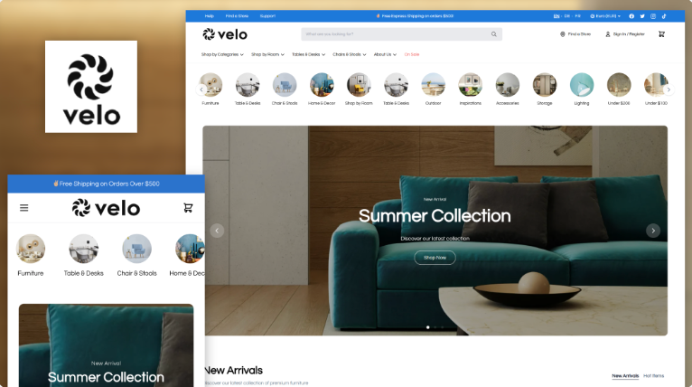

# Design successful site theme from scratch

This is your starting point for building a site theme. This article covers Ecwid requirements and gives clear, practical steps for designing a site theme **before you move to development**.

The focus is on structure, visuals, and consistency, so you can build a theme that meets platform standards and helps you monetize your work.

### Step 1. Define the vertical

Decide which vertical your theme should support.

Primary focus in Ecwid are:

* Apparel & Footwear
* Sports & Outdoor
* Bike and Golf
* Home & Garden
* Vape & Smoke
* Wine & Liquor
* Jewelry & Accessories


Check out pre-built themes from the Ecwid team for inspiration!


### Step 2. Decide on the content strategy

Before applying any rules, decide which one of the content strategies your theme will use:

*   **Brand-driven narratives**.\
    Rich, expressive storytelling to create a vivid sense of identity and atmosphere. \
    \
    They show how the theme performs when filled with immersive, cohesive brand content. The goal is to present a believable “mini-brand” that sells through mood and character. 

    <figure><figcaption></figcaption></figure>

    \
    Do:

    * Build a coherent narrative world, complete with values, history, voice, or mood.
    * Use expressive language that enhances the aesthetic.
    * Add brand details to the text when it feels appropriate.

    Don’t:

    * Lock the theme into a single industry niche.
    * Mix unrelated tones or break narrative consistency.
*   **Brand-independent narratives**\
    Stays broadly compatible with any brand, as they don’t construct a specific brand reality. The text should be coherent on its own, yet easy to replace. The goal is to illustrate theme structure using neutral, functional texts.\
    \
    Do:

    * Keep language simple, neutral, and brand-agnostic.
    * Use content that illustrates the type of information a merchant might place there without leaning into brand specifics or a distinct brand-focused tone of voice.
    * Use placeholders like “your company” instead of a brand name if needed.

    Don’t:

    * Use directive placeholders (“Add headline,” “Describe your product”).
    * Fill space with texts like “Lorem ipsum.”

    <figure><figcaption></figcaption></figure>

### Step 3. Create pseudo-brand

If you choose a brand-driven narrative, your theme will need a consistent style and a story to encourage users to try it out.

To create a brand:

* Define category/vertical and matching tone of voice for your brand.
* Fill in the texts: choose a name for your brand and add a short description.
* Choose the logo format (text or visual).

If it's a **visual logo**, generate a demo one. Check the following examples for inspiration: [LogoArchive](https://www.logo-archive.org/), [bpando.org](http://bpando.org/), [Namelix](https://namelix.com/), [brandmark.io](http://brandmark.io)&#x20;

<figure><figcaption></figcaption></figure>

If it's a **text logo**, pick one of the following font styles:

* Minimal/Quiet: clean text-only wordmark.
* Lifestyle/Soft: gentle serif or soft sans.
* Playful/Experimental: expressive or characterful wordmark.

Creating your brand logo early helps maintain consistency in demo content and ensures the theme's header and hero layout are designed appropriately. \
\
Do not forget about a favicon. It can be based on the logo, use the first letter of the brand name, or even be a simple icon without any text.

<figure><figcaption></figcaption></figure>

### Step 4. Choose featured products

Now that you have your content strategy, choose еhe products your theme will demonstrate by default.

You can use real photos or generated illustrations/images, but whatever you choose must fit the aesthetic. The way products look is one of the key factors merchants consider when choosing a theme.

Use sources like: [https://unsplash.com/](https://unsplash.com/), [https://www.pexels.com/](https://www.pexels.com/), [https://www.lummi.ai](https://www.lummi.ai) for photos, or [https://nanabanana.ai/](https://nanabanana.ai/) for generated content.

<figure><figcaption></figcaption></figure>

### Step 5. Choose the aesthetic style

Site themes should have their own mood and unique style.&#x20;

To help you decide, read detailed recommendations on aesthetic choices for a site and check out a pattern library for any visual elements you might need.

Use the [aesthetic-spectrum.md](resources/aesthetic-spectrum.md "mention") and [pattern-library.md](resources/pattern-library.md "mention") articles for inspiration to pick the style direction.

Review references and save 2–3 key websites that match the desired mood. Working with references can be a quick and easy way to choose the right design direction for a future theme.&#x20;

### Step 6. Define site structure

Outline the site structure that will be used later to build specific sections of your theme.

You can rely on the following proven layout structure:

* Hero
* Product grid
* Collection blocks
* Value/benefits
* Reviews
* Story/about block
* Footer

It’s best to check out the [Selling Ability](theme-quality-guidelines.md#id-3.-selling-ability-conversion-oriented-design) guideline to shape a clear, conversion-friendly flow. Add draft demo text for each section.

Here’s an example of a site structure:

<figure><figcaption></figcaption></figure>

### Step 7. Build the color palette

To create a modern and stylish theme, you need to:

* Define the 6-color palette: Lightest, Light, Soft Accent, Strong Accent, Dark, Darkest.
* Decide which color schemes are used for each section and whether your theme should support light/dark/accented modes.

Learn more: [How the 6-color brand palette works](theme-quality-guidelines.md#id-4.1-how-the-6-color-brand-palette-works)

### 8. Select imagery for the theme

Choose or generate images that support the chosen style. Images may come before or after color selection — both approaches work, as long as they harmonize.

Use sources [https://unsplash.com/](https://unsplash.com/), [https://www.pexels.com/](https://www.pexels.com/), [https://www.lummi.ai](https://www.lummi.ai)  or generate [https://nanabanana.ai/](https://nanabanana.ai/)

### 9. Assemble the theme

Place structure, texts, images, and palette. Refine spacing, hierarchy, rhythm, and visual cohesion. Compare your result with the 2–3 reference sites that you can find here.

If your design concept works, proceed to devloping: [quickstart-with-a-site-theme-example.md](../develop-site-themes/quickstart-with-a-site-theme-example.md "mention")&#x20;

### 10. Run a final quality check

Before calling the theme complete, review it using the [checklist-for-public-site-themes.md](../launch-site-themes/checklist-for-public-site-themes.md "mention")

It will help you quickly verify:

* content stability,
* visual quality,
* color-system compatibility,
* and basic selling ability.

If all checklist points pass, the theme is ready for internal review or handoff.

#### Summary and next steps

Now that you know the design requirements and have knowledge about Ecwid design resources, you can start working on your public theme:

* Bookmark guidelines and requirements for designing themes: [aesthetic-spectrum.md](resources/aesthetic-spectrum.md "mention"), [pattern-library.md](resources/pattern-library.md "mention"), [theme-quality-guidelines.md](theme-quality-guidelines.md "mention")
* Learn more about getting paid: [monetize-site-themes.md](../launch-site-themes/monetize-site-themes.md "mention")
* Start working on a technical realisation of your theme: [technical-guide-for-publishing-site-themes.md](../launch-site-themes/technical-guide-for-publishing-site-themes.md "mention")
* Once your theme is ready, self-review it with the [checklist-for-public-site-themes.md](../launch-site-themes/checklist-for-public-site-themes.md "mention")
* If passed, submit your theme to the Ecwid Apps team. 
