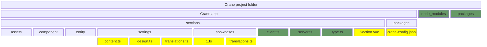

# How to use sections without Site themes

Any page on any Ecwid website is built from **sections**. When you create a Site themes, you basically build a one-column page couple from **Custom sections** whose order is specified in the theme file. &#x20;

However, custom sections can be used on their own, without a theme, thus allowing you to add new functionality and enhance the website's look without rebuilding it from scratch.&#x20;

### Create a project with sections without Site themes&#x20;

When you start working on a site customization project, you can skip importing theme files. In that case, all custom sections will become available in the Editor.

Find detailed instructions in the [Quickstart guide for building sections](quickstart-with-custom-sections-without-building-site-themes.md).

### Use Custom sections in the Editor

When your project doesn't have theme files, its custom sections can be freely used in the website editor.

To see all available custom sections, in the editor, click <kbd>**+ Add section**</kbd>**,** then click on the **Sections from App Market** in the left menu:

<figure><figcaption></figcaption></figure>

Custom sections, when built without a theme, are always available in the editor, even if a user applied a custom Site theme.

### Learn project structure without themes

The diagram below shows the folder structure of a project with one custom section:

Files and folders marked as <mark style="background-color:green;">**green**</mark> are internal; they shouldn't be touched.

Files marked with the <mark style="background-color:yellow;">**yellow**</mark> color are the ones you interact with:

* **../packages/crane-config.json** contains keys from your Ecwid app required for deploying the project.
* **../Section.vue** is the main file with the code that builds a section on the storefront.
* **../settings/content.ts** contains the content settings visible to the store owner in the Site editor. For example, such settings allow changing texts and images in the section.
* **../settings/design.ts** contains the design settings allowing the store owner to customize the content's colors, fonts, etc.
* **../settings/translations.ts** contains texts and translations for content and design settings visible in the Site editor.
* **../showcases/1.ts** sets content/design settings to define how the section preview looks. If you want to add multiple showcases for your section, add more files to the same folder. For example, **../2.ts**.
* **../showcases/translations.ts** contains texts and translations for the showcase files.

We recommend getting an Ecwid-built example section and using it to learn all the file and code dependencies.

### Start building sections

Now that you know how custom sections can work without theme, jump into building your own sections: [quickstart-with-custom-sections-without-building-site-themes.md](quickstart-with-custom-sections-without-building-site-themes.md "mention")
