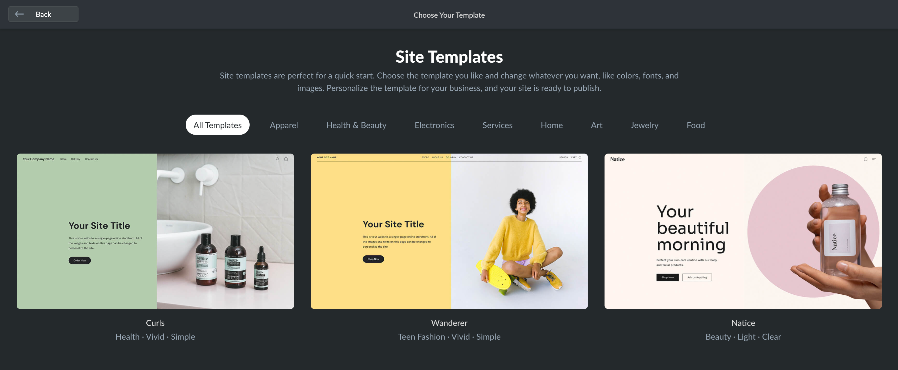
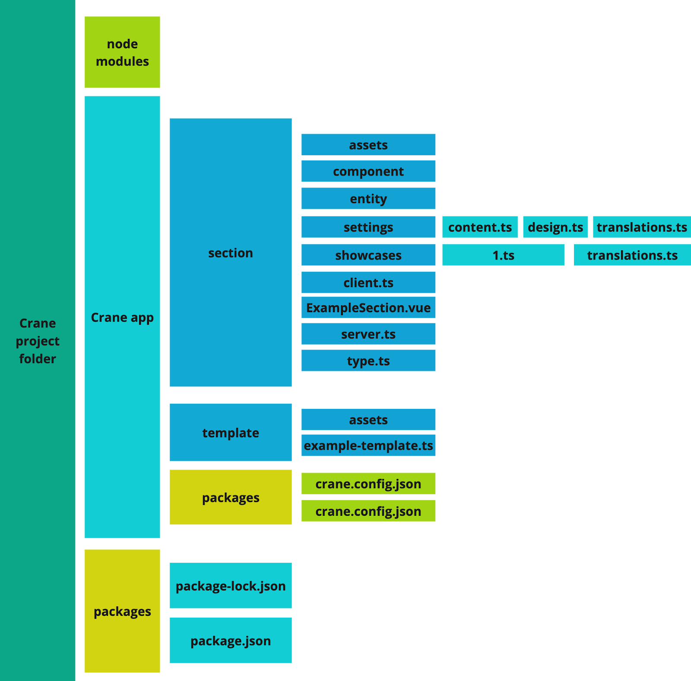

# Build Site templates: project structure

**Instant Site Template** is an arranged list of building blocks called **sections** that determine the overall style, content, and features of the Instant Site.

<figure><figcaption></figcaption></figure>

Templates don’t have any content or design settings of their own. Instead, they utilize **custom sections** where developers can put any HTML/JavaScript code, define content and design settings available to users, and create showcases.

Therefore, to build templates, you first need to create custom sections. From the user’s perspective, a template is only a starting point. They will modify and reorder sections within a template to personalize Instant Site to their needs.

The content inside sections can be **modifiable** and **unmodifiable**. As a developer, you have full control over what parts of the section users can change.

### Template code organization

When you start working with the template code, you’ll notice it has a strict folder structure based on the custom sections.

Here is the example structure with all mandatory files:

```
[main project folder]
  /crane-config.json
  /templates
    /template-name.ts
    /assets/
  /sections
    /section-name
      /section-name.vue
      /settings
        /content.ts
        /design.ts
        /translations.ts
      /assets
      /showcases
        /1.ts
        /translations.ts

```

<figure><figcaption><p>Visualization of the template project structure</p></figcaption></figure>


The `crane-config.json` file connects the local environment with your application in Ecwid. Set up the config before developing the template code.

The `templates` folder contains `template-name.ts` files that define templates and `assets` folder with showcase images and other additional files.

The `sections` folder contains custom sections that you can use in templates. Every `section-name` folder must have the main `section-name.ts` file with both **modifiable** and **unmodifiable** content, `settings`, `assets`, and `showcases` folders:

* `content.ts`, `design.ts`, and `translation.ts` files in the settings folder define **modifiable** content and design settings available to users in the Instant Site Editor: texts, colors, fonts, etc.
* `1.ts` and `translations.ts` files in the showcases folder define section previews visible in the Instant Site Editor. Each section must have at least one showcase.
* `assets` folder contains any additional files used in the section, for example, showcase images.

All other files in the project folder are internal. Find the detailed technical description for all files required to build a template in the articles below.
