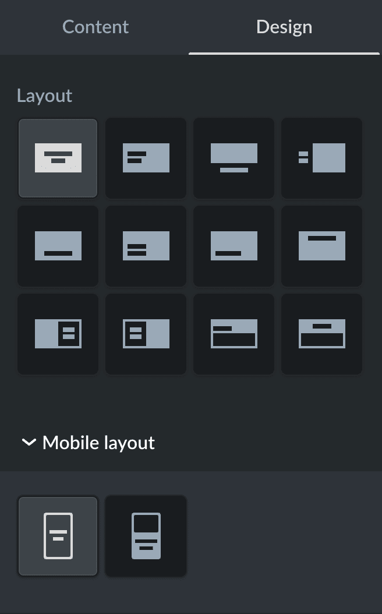

# layout.ts

The `layout.ts` file defines the layout settings available to developers for custom sections in the Instant Site Editor. Developers can use this file to configure and manage layouts for merchants allowing them to select predefined or custom layout icons.

Each layout is defined as an object with specific properties. You can add multiple layouts to the `layout.ts` file, in which case, a layout selector appears in the Design tab of the Editor. Merchants can switch between layouts using the provided icons. If fewer than two layouts are defined, the layout selector is hidden, and the default layout is applied.

If two or more layouts are defined in the file, you'll see the **layout selector** in the Editor:

<figure><figcaption></figcaption></figure>

Find the full list of **layout settings** below:

| Setting                 | Type             | Description                                                                                                                                                                                                                                                                                                |
| ----------------------- | ---------------- | ---------------------------------------------------------------------------------------------------------------------------------------------------------------------------------------------------------------------------------------------------------------------------------------------------------- |
| layoutId                | string           | <p>Unique identifier for each layout defined in the file.<br><strong>Required</strong></p>                                                                                                                                                                                                                 |
| layoutIcon              | string           | <p>Icon displayed to merchants in the layout selector. If not set, a default icon with the layout index is used.</p><p>Find a full list of available icons below.<br><strong>Optional</strong></p>                                                                                                         |
| selectedContentSettings | array of strings | <p>Content elements used in the layout. If empty, all content settings are shown.<br><strong>Optional</strong></p>                                                                                                                                                                                         |
| selectedDesignSettings  | array of objects | <p>Design settings for the content elements added to the layout. <br><br>Each object includes field names, types, and default values. If empty, all design settings are shown. The structure inside each object matches the one from the <strong>design.ts</strong> file.<br><strong>Optional</strong></p> |
| defaults                | object           | <p>Default values for the layout design settings. If specified, override defaults from <code>selectedDesignSettings</code>, but can still be changed by users in the editor.<br><strong>Optional</strong></p>                                                                                              |

Code example for 'design.ts':

```ts
{
  layoutId: 'Custom_layout_1', 
  layoutIcon: 'COVER_FULLSCREEN_CENTER',
  selectedContentSettings: ['section_title', 'section_description],
  selectedDesignSettings: [
    {
      fieldName: 'section_description',  // Design setting field name
    },
    {
      fieldName: 'image_text',
      type: 'TEXT',                      // Optional. Design setting type. Required when defaults is setting here
      defaults: {                        // Optional. Design setting default. The value setted here will replace
        font: 'global.fontFamily.body',  // the one in the design.ts for this layout. Wrong defaults or type will
        size: 16,                        // result in possible breaking the reference section.
        bold: true,
        italic: false,
        color: '#000000',
        visible: true,
      },
    },
  ],
},
```

#### `layoutIcon`

Full list of icons for layout selector you can use in the `layoutIcon` field:

`HEADER_LEFT`, `HEADER_CENTER_LOGO_BURGER`, `HEADER_CENTER_LOGO_COMPACT`, `HEADER_CENTER_LOGO_DETAILED`, `HEADER_LEFT_LOGO_BURGER`, `HEADER_LEFT_LOGO_COMPACT`, `HEADER_LEFT_LOGO_DETAILED`, `HEADER_LEFT_LOGO_SEARCH`, `HEADER_LEFT_LOGO_TEXT`

`TEXT_ONE_COLUMN`, `TEXT_TITLE_LEFT`, `TEXT_SUBTITLE_RIGHT`, `TEXT_TWO_COLUMNS`, `TEXT_CENTER`, `TEXT_DESCRIPTION_RIGHT`

`CTA_BANNER_LEFT`, `CTA_BANNER_RIGHT`, `CTA_BANNER_CENTER`, `CTA_BANNER_BOTTOM`, `CTA_PROMO_BAR_LEFT`, `CTA_PROMO_BAR_RIGHT`, `CTA_STORY_LEFT`, `CTA_STORY_RIGHT`, `CTA_FULLWIDTH_CENTER`, `CTA_FULLWIDTH_LEFT`

`COVER_FULLSCREEN_CENTER`, `COVER_FULLSCREEN_LEFT`, `COVER_FULLSCREEN_CENTER_LEFT`, `COVER_FULLSCREEN_RIGHT`, `COVER_FULLSCREEN_BOTTOM`, `COVER_FULLSCREEN_BOTTOM_RIGHT`, `COVER_FULLSCREEN_BOTTOM_LEFT`, `COVER_FULLSCREEN_TOP`, `COVER_SIDEBAR_RIGHT`, `COVER_SIDEBAR_LEFT`, `COVER_HALFSCREEN_LEFT`, `COVER_HALFSCREEN_CENTER`, `COVER_COLLAGE_BOTTOM`, `COVER_COLLAGE_LEFT`

`IMAGE_SUBTITLE_RIGHT`, `IMAGE_TITLE_LEFT`, `IMAGE_LEFT`, `IMAGE_RIGHT`, `IMAGE_CENTER`, `IMAGE_SIDE_TITLE`

`LOCATION_MAP_RIGHT`, `LOCATION_MAP_LEFT`, `LOCATION_IMAGE_RIGHT`, `LOCATION_IMAGE_LEFT`, `LOCATION_BACKGROUND_RIGHT`, `LOCATION_BACKGROUND_LEFT`, `LOCATION_FULL`, `LOCATION_SHORT`

`REVIEWS_MINIMAL`, `REVIEWS_CARDS`, `REVIEWS`, `REVIEWS_CLASSIC`, `REVIEWS_FULLSCREEN_BG`, `REVIEWS_FULLSCREEN_SIDEBAR_LEFT`, `REVIEWS_FULLSCREEN_SIDEBAR_RIGHT`, `REVIEWS_CARDS_PHOTO`, `REVIEWS_PHOTO_SPEECH_RIGHT`, `REVIEWS_PHOTO_SPEECH_LEFT`, `REVIEWS_SOCIAL_FEED`, `REVIEWS_ADAPTIVE`

`FEATURES_CLASSIC_CENTER`, `FEATURES_CLASSIC_LEFT`, `FEATURES_ACCORDION`, `FEATURES_MINIMAL`, `FEATURES_SMALL_ICONS`, `FEATURES_CAROUSEL`, `FEATURES_IMAGE_LEFT`, `FEATURES_IMAGE_RIGHT`

`ANNOUNCEMENT_CENTER`

`SLIDER_FULLSCREEN_CENTER`, `SLIDER_FULLSCREEN_LEFT`
