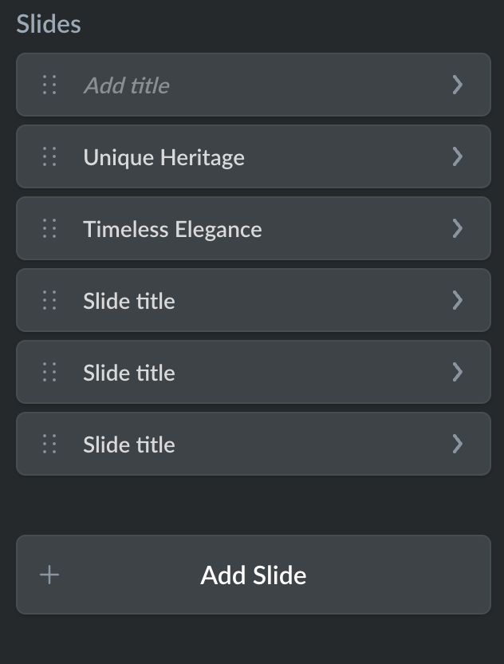

# content.ts

This file defines section content settings available to users in the website Editor. If some content settings like texts or images should be **modifiable** or if you want to provide some choices for users, you must add these settings to the `content.ts` file.

Ecwid will automatically build UI for the Editor, so you only need to declare the settings and their properties, for example, type and label, in this file. And import user settings to the `section-name.vue` file.

Each setting is referred to as an **element** and is defined by the `element_id` object with its properties inside. You can add multiple elements of the same `type` to the file if they have unique `element_id`. If some of the content settings should have related design settings, use the same `element_id` in both `content.ts` and `design.ts` files to link them.

Code example for a simple "Main title" input field (label and placeholder texts are defined in `translations.ts` file):

```ts
export default {
	element_id: {
		type: 'INPUTBOX',
		label: '$label.section_description.label',
		placeholder: '$label.section_description.placeholder',
	},
} as const;
```

"Main title" input field in the Instant Site Editor:

<figure><figcaption></figcaption></figure>

Find the full list of available content settings and their properties below:

### `INPUTBOX`

This element adds a single-line text input field to user settings available for the section.

List of properties:

| Name        | Type   | Description                                                                                                                                   |
| ----------- | ------ | --------------------------------------------------------------------------------------------------------------------------------------------- |
| type        | string | <p>Type of the setting that defines its functionality. In this case, has <code>INPUTBOX</code> value.<br></p><p><strong>Required</strong></p> |
| label       | string | <p>Title displayed above the element in Instant Site Editor.</p><p><br><strong>Optional</strong></p>                                          |
| placeholder | string | <p>Placeholder value displayed in the Editor until a user types something in the field.</p><p><br><strong>Optional</strong></p>               |
| defaults    | object | <p>Default values for the element.</p><p><br><strong>Optional</strong></p>                                                                    |

#### `defaults`

If `defaults` are presented and there is no showcase overriding its values, these values will be used as default. users will be able to change them after adding a section in the IS Editor.

| Name | Type   | Description                                                                                                             |
| ---- | ------ | ----------------------------------------------------------------------------------------------------------------------- |
| text | string | <p>Default value for the input field. Overrides <code>placeholder</code> value.<br></p><p><strong>Optional</strong></p> |

Code example:

```ts
element_id: {
    type: 'INPUTBOX',
    label: '$label.element_id.label',
    placeholder: '$label.element_id.placeholder',
}
```

### `TEXTAREA`

This element adds a multi-line text input field to user settings available for the section.

List of properties:

| Name        | Type   | Description                                                                                                                                   |
| ----------- | ------ | --------------------------------------------------------------------------------------------------------------------------------------------- |
| type        | string | <p>Type of the setting that defines its functionality. In this case, has <code>TEXTAREA</code> value.<br></p><p><strong>Required</strong></p> |
| label       | string | <p>Title displayed above the element in Instant Site Editor.</p><p><br><strong>Optional</strong></p>                                          |
| placeholder | string | <p>Placeholder value displayed in the Editor until a user types something in the field.</p><p><br><strong>Optional</strong></p>               |
| defaults    | object | <p>Default values for the element.</p><p><br><strong>Optional</strong></p>                                                                    |

#### `defaults`

If `defaults` are presented and there is no showcase overriding its values, these values will be used as default. users will be able to change them after adding a section in the IS Editor.

| Name | Type   | Description                                                                                                             |
| ---- | ------ | ----------------------------------------------------------------------------------------------------------------------- |
| text | string | <p>Default value for the input field. Overrides <code>placeholder</code> value.<br></p><p><strong>Optional</strong></p> |

Code example:

```ts
element_id: {
    type: 'TEXTAREA',
    label: '$label.element_id.label',
    placeholder: '$label.element_id.placeholder',
}
```

### `BUTTON`

This element adds a configurable button to user settings available for the section.

List of properties:

| Name     | Type   | Description                                                                                                                                 |
| -------- | ------ | ------------------------------------------------------------------------------------------------------------------------------------------- |
| type     | string | <p>Type of the setting that defines its functionality. In this case, has <code>BUTTON</code> value.<br></p><p><strong>Required</strong></p> |
| label    | string | <p>Title displayed above the element in Instant Site Editor.</p><p><br><strong>Optional</strong></p>                                        |
| defaults | object | <p>Default values for the element.</p><p><br><strong>Optional</strong></p>                                                                  |

#### `defaults`

| Name       | Type   | Description                                                                                                                                                                                                                                                                                                                                                                                                                                                                     |
| ---------- | ------ | ------------------------------------------------------------------------------------------------------------------------------------------------------------------------------------------------------------------------------------------------------------------------------------------------------------------------------------------------------------------------------------------------------------------------------------------------------------------------------- |
| title      | string | <p>Title that will be rendered on the button itself.</p><p></p><p><strong>Optional</strong></p>                                                                                                                                                                                                                                                                                                                                                                                 |
| buttonType | string | <p></p><p>Type of the button defining its functionality. Available values:</p><ul><li><code>SCROLL_TO_TILE</code>: Scrolls to a specific Instant Site section.</li><li><code>HYPER_LINK</code>: Go to link.</li><li><code>MAIL_LINK</code>: Compose email.</li><li><code>TEL_LINK</code>: Call phone.</li><li><code>GO_TO_STORE_LINK</code>: Go to store.</li><li><code>GO_TO_PAGE</code>: Go to site page. <em>Work in progress</em></li></ul><p><strong>Optional</strong></p> |
| tileId     | string | <p>For <code>SCROLL_TO_TILE</code> button type only. Sets a default website page for the "Go to site page" button. </p><p></p><p><em>Work in progress</em></p>                                                                                                                                                                                                                                                                                                                  |
| link       | string | For `HYPER_LINK` button type only. Sets a default URL for the "Go to link" button.                                                                                                                                                                                                                                                                                                                                                                                              |
| email      | string | For `MAIL_LINK` button type only. Sets a default email for the "Compose email" button.                                                                                                                                                                                                                                                                                                                                                                                          |
| phone      | string | For `TEL_LINK` button type only. Sets a default phone number for the "Call phone" button.                                                                                                                                                                                                                                                                                                                                                                                       |

Code example:

```ts
element_id: {
    type: 'BUTTON',
    label: '$label.element_id.label',
    defaults: {
        title: 'Contact API Support',
        buttonType: 'MAIL_LINK',
        email: 'ec.apps@lightspeedhq.com',
    },
}
```

### `IMAGE`

This element adds an image uploader to user settings available for the section.

List of properties:

| Name     | Type   | Description                                                                                                                                |
| -------- | ------ | ------------------------------------------------------------------------------------------------------------------------------------------ |
| type     | string | <p>Type of the setting that defines its functionality. In this case, has <code>IMAGE</code> value.<br></p><p><strong>Required</strong></p> |
| label    | string | <p>Title displayed above the element in Instant Site Editor.</p><p><br><strong>Optional</strong></p>                                       |
| defaults | object | <p>Default values for the element.</p><p><br><strong>Optional</strong></p>                                                                 |

#### `defaults`

| Name      | Type   | Description                                                                    |
| --------- | ------ | ------------------------------------------------------------------------------ |
| imageData | object | <p>Data about the default uploaded image.<br><br><strong>Optional</strong></p> |

#### `imageData`

| Name       | Type   | Description                                                                                                                                                                                                                                                                                                                                                                                                                                                                                                                                                                                                      |
| ---------- | ------ | ---------------------------------------------------------------------------------------------------------------------------------------------------------------------------------------------------------------------------------------------------------------------------------------------------------------------------------------------------------------------------------------------------------------------------------------------------------------------------------------------------------------------------------------------------------------------------------------------------------------- |
| set        | map    | <p></p><p>Map with the <code>{ ImageResolution -> ImageInfo }</code> structure, where:</p><ul><li><code>ImageResolution</code> must be one of the <code>ORIGINAL, LOW_RES</code>, <code>MID_RES, HI_RES</code>, <code>HI_2X_RES, WEBP_LOW_RES</code>, <code>WEBP_MID_RES</code>, <code>WEBP_HI_RES</code>, <code>WEBP_HI_2X_RES</code>, <code>MOBILE_LOW_RES</code>, <code>MOBILE_MID_RES</code>, <code>MOBILE_HI_RES</code>, <code>MOBILE_WEBP_LOW_RES</code>, <code>MOBILE_WEBP_MID_RES</code>, <code>MOBILE_WEBP_HI_RES</code>.</li><li><code>ImageInfo</code> is an object with the image details.</li></ul> |
| borderInfo | object | Information about image border.                                                                                                                                                                                                                                                                                                                                                                                                                                                                                                                                                                                  |

#### `imageInfo`

| Name   | Type   | Description                                                                                                                                                                                              |
| ------ | ------ | -------------------------------------------------------------------------------------------------------------------------------------------------------------------------------------------------------- |
| url    | string | <p>Link to the image. For images added to the /section-name/assets/ folder, you only need to list the name of the image, for example, <code>image.png</code>.</p><p></p><p><strong>Optional</strong></p> |
| width  | string | <p>Original image width.</p><p></p><p><strong>Optional</strong></p>                                                                                                                                      |
| height | string | <p>Original image height.</p><p></p><p><strong>Optional</strong></p>                                                                                                                                     |

#### `borderInfo`

| Name       | Type    | Description                                   |
| ---------- | ------- | --------------------------------------------- |
| homogenity | boolean | If `true`, all the border has the same color. |
| color      | object  | Border color in RGBA format.                  |

#### `color`

| Name | Type   | Description                               |
| ---- | ------ | ----------------------------------------- |
| r    | number | R-channel value for the border color.     |
| g    | number | G-channel value for the border color.     |
| b    | number | B-channel value for the border color.     |
| a    | number | Alpha-channel value for the border color. |

Code example:

```ts
element_id: {
  type: 'IMAGE',
  label: '$label.element_id.label',
  defaults: {
    imageData: {
      set: {
        LOW_RES: {
          url: 'new_arrivals_mobile_low.jpeg',
        },
        MOBILE_WEBP_LOW_RES: {
          url: 'new_arrivals_mobile_low.jpeg',
        },
        MOBILE_WEBP_HI_RES: {
          url: 'new_arrivals_mobile_high.jpeg',
        },
        WEBP_LOW_RES: {
          url: 'new_arrivals_pc_low.jpeg',
        },
        WEBP_HI_2X_RES: {
          url: 'new_arrivals_pc_high.jpeg',
        },
      },
      borderInfo: {},
    },
  }
}
```

### `TOGGLE`

This element adds a toggle to user settings available for the section.

List of properties:

| Name        | Type   | Description                                                                                                                                |
| ----------- | ------ | ------------------------------------------------------------------------------------------------------------------------------------------ |
| type        | string | <p>Type of the setting that defines its functionality. In this case, has <code>IMAGE</code> value.<br></p><p><strong>Required</strong></p> |
| label       | string | <p>Title displayed above the element in Instant Site Editor.</p><p><br><strong>Optional</strong></p>                                       |
| description | string | <p>Description displayed under the element in the Editor.</p><p></p><p><strong>Optional</strong></p>                                       |
| defaults    | object | <p>Default values for the element.</p><p><br><strong>Optional</strong></p>                                                                 |

#### `defaults`

| Name    | Type    | Description                                                                                       |
| ------- | ------- | ------------------------------------------------------------------------------------------------- |
| enabled | boolean | <p>Default toggle state. <code>true</code> if enabled.</p><p></p><p><strong>Optional</strong></p> |

Code example:

```ts
element_id: {
    type: 'TOGGLE',
    label: '$label.element_id.label',
    description: '$label.element_id.description',
    defaults: {
        enabled: true,
    },
}
```

### `SELECTBOX`

This element adds a dropdown list to user settings available for the section.

List of properties:

| Name        | Type   | Description                                                                                                                                |
| ----------- | ------ | ------------------------------------------------------------------------------------------------------------------------------------------ |
| type        | string | <p>Type of the setting that defines its functionality. In this case, has <code>IMAGE</code> value.<br></p><p><strong>Required</strong></p> |
| label       | string | <p>Title displayed above the element in Instant Site Editor.</p><p><br><strong>Optional</strong></p>                                       |
| description | string | <p>Description displayed under the element in the Editor.</p><p></p><p><strong>Optional</strong></p>                                       |
| options     | object | <p>List of available choices in the dropdown list.</p><p></p><p><strong>Optional</strong></p>                                              |
| defaults    | object | <p>Default values for the element.</p><p><br><strong>Optional</strong></p>                                                                 |

#### `options`

| Name  | Type   | Description                                   |
| ----- | ------ | --------------------------------------------- |
| label | string | Description displayed under the option value. |
| value | string | Option value.                                 |

#### `defaults`

| Name  | Type   | Description                                                                         |
| ----- | ------ | ----------------------------------------------------------------------------------- |
| value | string | Default option value. Must match one of the option values defined in the `options`. |

Code example:

```ts
element_id: {
    type: 'SELECTBOX',
    label: '$label.element_id.label',
    description: '$label.element_id.description',
    options: {
        label: '$label.element_id.option_1.label',
        value: 'Option 1',
    },
    defaults: {
        value: 'Option 1',
    },
}
```

### `INFO`

This element adds an unmodifiable information block with text and an optional button. Use it to add some marketing/educational information to the Editor. For example: _"Need help? Contact developer: \[Email button]"_ block displayed under the section settings.

List of properties:

| Name        | Type   | Description                                                                                                                                |
| ----------- | ------ | ------------------------------------------------------------------------------------------------------------------------------------------ |
| type        | string | <p>Type of the setting that defines its functionality. In this case, has <code>IMAGE</code> value.<br></p><p><strong>Required</strong></p> |
| label       | string | <p>Title displayed above the element in Instant Site Editor.</p><p><br><strong>Optional</strong></p>                                       |
| description | string | <p>Description displayed under the element in the Editor.</p><p></p><p><strong>Optional</strong></p>                                       |
| button      | object | <p>Pre-configured button for the information block.</p><p></p><p><strong>Optional</strong></p>                                             |
| defaults    | object | <p>Default values for the element.</p><p><br><strong>Optional</strong></p>                                                                 |

#### `button`

| Name  | Type   | Description                   |
| ----- | ------ | ----------------------------- |
| label | string | Text displayed on the button. |
| link  | string | Button link.                  |

#### `defaults`

| Name  | Type   | Description                                                        |
| ----- | ------ | ------------------------------------------------------------------ |
| title | string | Default button text. If exists, overrides the `button.label` text. |
| link  | string | Default button link. if exists, overrides the `button.link` value. |

Code example:

```ts
element_id: {
    type: 'INFO',
    label: '$label.element_id.label',
    description: '$label.element_id.description',
    button: {
        label: '$label.element_id.button.label',
        link: 'https://example.com',
    },
}
```

### `DIVIDER`

Allows you to add a divider line between elements of content/design settings. It only affects the appearance of your section settings on the Editor page and doesn't change how the section is displayed on the storefront in any way.

List of properties:

| Name | Type   | Description                                                                                                                                                                                                                                  |
| ---- | ------ | -------------------------------------------------------------------------------------------------------------------------------------------------------------------------------------------------------------------------------------------- |
| type | string | <p>Type of the setting that defines its functionality. In this case, has <code>DIVIDER</code> value.<br><br>Divider doesn't have any additinal settings, so it's the only field that should be here.<br></p><p><strong>Required</strong></p> |

Code example:

```typescript
element_id: {
    type: 'DIVIDER',
    label: '$label.element_id.label',
    description: '$label.element_id.description',
    button: {
        label: '$label.element_id.button.label',
        link: 'https://example.com',
    },
}
```

### `DECK`

This element allows you to add a group of settings under a re-organizable card. Use it to add a slider with something like product slides or review cards.

How it looks in the Editor:

<figure><figcaption></figcaption></figure>


List of properties:

<table><thead><tr><th width="183">Name</th><th width="97">Type</th><th>Description</th></tr></thead><tbody><tr><td>type</td><td>string</td><td><p>Type of the setting that defines its functionality. In this case, has <code>DECK</code> value.</p><p></p><p><strong>Required</strong></p></td></tr><tr><td>label</td><td>string</td><td><p>Deck title displayed before the list of cards, for example "Slides" on the image above.</p><p></p><p><strong>Optional</strong></p></td></tr><tr><td>addButtonLabel</td><td>string</td><td><p>Text on the button below the list of cards. For example, "Add Slide" on the image above.<br>The button always has the same function: adding a new card.</p><p></p><p><strong>Optional</strong></p></td></tr><tr><td>maxCards</td><td>number</td><td><p>The maximum number of cards in the deck.</p><p></p><p><strong>Optional</strong></p></td></tr><tr><td>cards</td><td>object</td><td><p>Content settings for all cards added to the deck. It can include any set of settings available with the Crane tool, for example <code>BUTTON</code>, <code>SELECTBOX</code>, <code>IMAGE</code>, etc.</p><p></p><p>There is no limit to the number of settings, but all cards in the deck will have all these settings.</p><p></p><p><strong>Required</strong></p></td></tr></tbody></table>

#### `cards`

| Name               | Type   | Description           |
| ------------------ | ------ | --------------------- |
| defaultCardContent | object | Default card settings |

#### `defaultCardContent`

| Name     | Type   | Description                                                                               |
| -------- | ------ | ----------------------------------------------------------------------------------------- |
| label    | string | Default name displayed on cards. For example, "Slide title" on the image above.           |
| settings | object | Content settings that all cards added to the deck will have. Check out the example below. |

Code example:

```ts
export default {
  images: {
    type: 'DECK',
    label: '$label.images.deck_title',
    addButtonLabel: '$label.images.add_card_button',
    maxCards: 5,
    cards: {
      defaultCardContent: {
        label: '$label.images.card_title',
        settings: {
          image_content: {
            type: 'IMAGE',
            label: '$label.image_content_1.label',
            defaults: {
              set: {
                LOW_RES: {
                  url: 'new_arrivals_mobile_low.jpeg',
                },
                MOBILE_WEBP_LOW_RES: {
                  url: 'new_arrivals_mobile_low.jpeg',
                },
                MOBILE_WEBP_HI_RES: {
                  url: 'new_arrivals_mobile_high.jpeg',
                },
                WEBP_LOW_RES: {
                  url: 'new_arrivals_pc_low.jpeg',
                },
                WEBP_HI_2X_RES: {
                  url: 'new_arrivals_pc_high.jpeg',
                },
              },
              borderInfo: {},
            },
          },
          image_text: {
            type: 'TEXTAREA',
            label: '$label.image_text_1.label',
            placeholder: '$label.image_text.placeholder',
            defaults: {
              text: '$label.images.default.image_text',
            },
          },
          image_link: {
            type: 'INPUTBOX',
            label: '$label.image_link_1.label',
            placeholder: '$label.image_link.placeholder',
            defaults: {
              text: '$label.images.default.image_link.text',
            },
          },
        },
      },
    },
  }
} as const;
```
