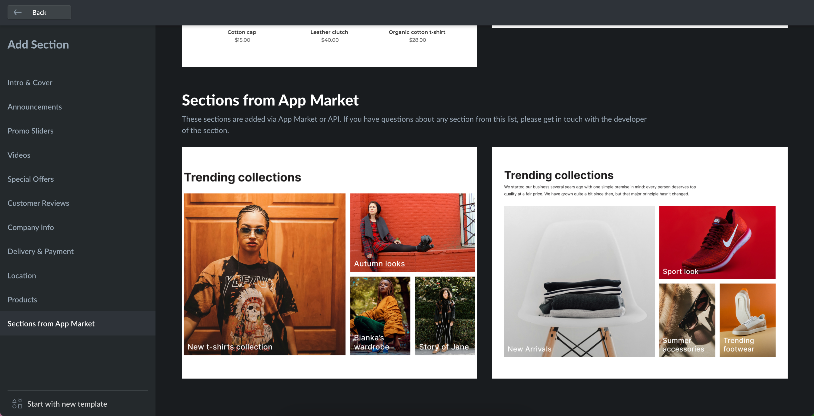

# showcases/1.ts

Showcase files are displayed as section previews in the Instant Site Editor. With showcases, you can explain and promote specific features of your template to users.

<figure><figcaption></figcaption></figure>

You can create several showcases for the same section by adding more than one file to the /showcases/ folder. These showcases can also be used in template-name.ts files.

Different showcases for the same section are defined by their ID. It starts and iterates by 1. Showcases also have their own translations.ts file for text labels with the same logic. For example, if you want to add three showcases, your folder will contain four files:

```
section-name/  
  showcases/  
    1.ts  
    2.ts  
    3.ts  
    translations.ts
```

Each showcase file includes the following fields:

| Setting      | Type   | Description                                                                                                                        |
| ------------ | ------ | ---------------------------------------------------------------------------------------------------------------------------------- |
| showcaseId   | string | Numeric showcase ID converted to string type. Defines the order in which showcases are displayed in the Editor. Starts with `'1'`. |
| previewImage | obj    | Showcase preview image for section browser in the Editor.                                                                          |
| blockName    | string | Text label for the section name displayed in the left menu.                                                                        |
| content      | obj    | Default settings for the section elements declared in the 'content.ts' file.                                                       |
| design       | obj    | Default settings for types declared in the 'design.ts' file.                                                                       |

Showcase files don't have to cover all declared content and design settings. Additionally, you can add several images for one `IMAGE` element type depending on the user's device and screen size.

Code example for 'showcase/1.ts' file:

```ts
showcaseId: '1',
previewImage: {
	set: {
		ORIGINAL: {
			url: 'preview_image.jpg',
		},
	},
},
blockName: '$label.showcase_1_name',
content: {
	text_input_1: {
		type: 'INPUTBOX',
		text: '$label.showcase_1_input_1',
	},
	text_input_2: {
		type: 'TEXTAREA',
		text: '$label.showcase_1_input_2',
  },
  image_content_1: {
		type: 'IMAGE',
		imageData: {
			set: {
				ORIGINAL: {
					url: 'new_arrivals_pc_high.jpeg',
				},
				MOBILE_WEBP_LOW_RES: {
					url: 'new_arrivals_mobile_low.jpeg',
				},
				MOBILE_WEBP_HI_RES: {
					url: 'new_arrivals_mobile_high.jpeg',
				},
				WEBP_LOW_RES: {
					url: 'new_arrivals_pc_low.jpeg',
				},
				WEBP_HI_2X_RES: {
					url: 'new_arrivals_pc_high.jpeg',
				},
			},
			borderInfo: {},
		},
	},
design: {
	text_input_1: {
		type: 'TEXT',
		font: 'global.fontFamily.body',
		size: 44,
		bold: true,
		italic: false,
		color: '#333',
	},
	background: {
		type: 'BACKGROUND',
		style: 'COLOR',
		color: 'global.color.background',
	}
}
```
