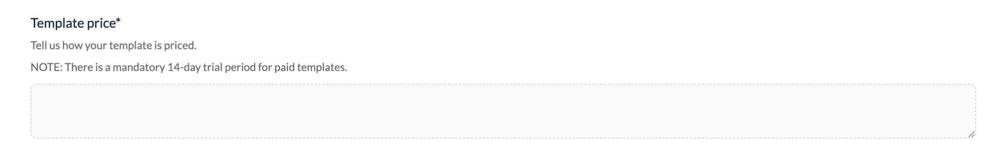

# Monetize Site themes

With public Site themes, you get access to a new feature available to thousands of Ecwid clients. Clients are offered both free and paid Site themes, and you have full control over setting the price for your themes.

When published, your themes become available to all merchants right in the website editor. Ecwid will take care of billing and payouts for you.

Here’s why selling your themes on Ecwid is a great opportunity:

* **Brand-new market**: Site themes are a fresh feature with an open market, offering great potential for early contributors.
* **High demand for new themes**: Most Ecwid users are potentially your users too.
* **Hassle-free payments**: Simply set your monthly price during the publishing process, and Ecwid takes care of billing merchants and paying out revenue to you.
* **Flexible pricing**: You can adjust the themes price anytime. Our Support team will help you with processing any necessary refunds.
* **Detailed reports**: Receive automated monthly reports that include stats about usage and generated revenue from your themes.
* **Multiple payout currency**: Choose to receive payments in USD, EUR, GBP, AUD, MXN, and INR.

### How to start getting payouts with themes

You can build a Site theme and offer it on a paid basis. Ecwid billing allows you to set up a monthly price for the theme during the publishing process. The one-time purchase model is not supported.

Once a theme is published, it becomes available in the website builder, where clients can see the theme preview and its price. If they decide to install your theme, Ecwid will offer a 14-day trial period after which a merchant will be charged for it.

Want to start selling your Site themes? Jump into the [quickstart-with-a-site-theme-example.md](../develop-site-themes/quickstart-with-a-site-theme-example.md "mention")

The billing process is fully automated on our side, so you don’t need to build any kind of billing system. Before going live, you’ll set a monthly price for your Site theme in the publishing form:

<figure><figcaption></figcaption></figure>

When the theme goes live, you’ll get access to automated monthly reports that include installs, usage, and generated revenue stats.

Payouts are made quarterly to your PayPal account or bank account in supported payout currencies. You can leave your PayPal address in the publishing form:

<figure><figcaption></figcaption></figure>
